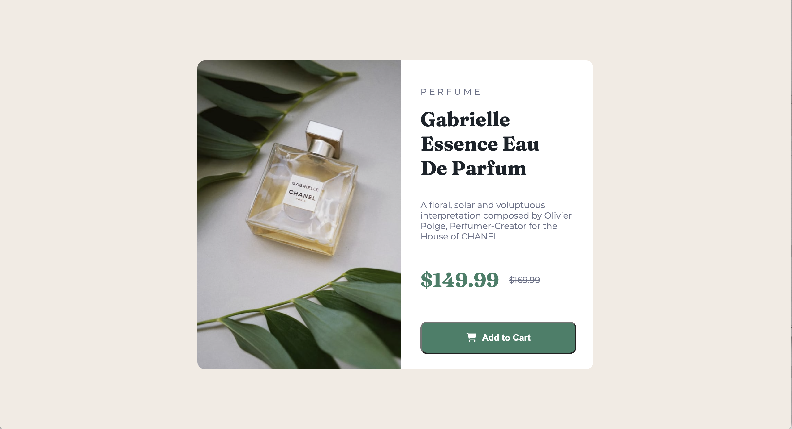
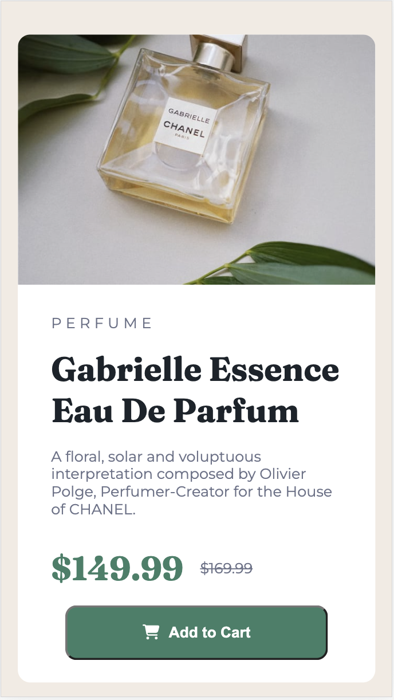

# Frontend Mentor - Product preview card component solution
My solution for FrontEndMentor's Product Preview Card challenge

This is a solution to the [Product preview card component challenge on Frontend Mentor](https://www.frontendmentor.io/challenges/product-preview-card-component-GO7UmttRfa). Frontend Mentor challenges help you improve your coding skills by building realistic projects. 

## Table of contents

- [Overview](#overview)
  - [The challenge](#the-challenge)
  - [Screenshots](#screenshot)
- [My process](#my-process)
  - [Built with](#built-with)
  - [What I learned](#what-i-learned)
  - [Continued development](#continued-development)
- [Author](#author)

**Note: Delete this note and update the table of contents based on what sections you keep.**

## Overview

### The challenge

Users should be able to:

- View the optimal layout depending on their device's screen size
- See hover and focus states for interactive elements
  
### Screenshots

  
  

### Links

- Solution URL: [Add solution URL here](https://your-solution-url.com)
- Live Site URL: [Add live site URL here](https://your-live-site-url.com)

## My process

### Built with

- Semantic HTML5 markup
- CSS custom properties
- Flexbox
- CSS Media Queries

### What I learned

My biggest hurdle with completing this challenge was wrapping my head around media queries. In particular, I had a heck of a time figuring out how to get a different image displayed on a smaller screen. That solution was a lot easier than I thought it would be, though! I eventually figured it all out, but I'm not sure if there's a easier way to get everything looking nice with my media queries. It all worked out how I wanted it to look, but I'm not sure if my approach could be simplified. 

I also got a bit more comfortable with properly structuring my HTML and CSS. I did away with ID tags in favor of classes, and took time to organize my CSS after I was done. Further, I moved away from using px's and instead used em/rem units.

### Continued development

I hope to keep taking on responisive challenges and get even more confident with media queries. I figured it out eventually, but it took me awhile! With more experience, I hope to be able to speed up that process a lot. For a future project, I'd also like to give mobile-first design a go.

## Author

- Git - [christinepallon](https://github.com/christinepallon)
- Frontend Mentor - [@christinepallon](https://www.frontendmentor.io/profile/christinepallon)
- Twitter - [@xtine_files](https://www.twitter.com/xtine_files)
